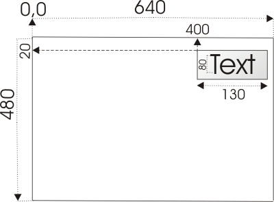
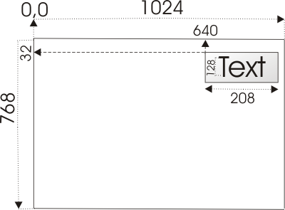

# DG Documentation
 
 ## Overview

DG (a short name of DirectGUI) is an intermediate level ANSI C graphics library which aims to define an abstract interface being easily implemented on arbitrary graphics engines. As DG is an interface it is represented by its implementations. Currently DG supports DirectFB (Direct Frame Buffer) and Microsoft Direct X. That makes possible for an application
built on top of DG to be automatically ported between Linux and Windows.

DG interface provides functions for creating graphics context and controls for building user interfaces. That includes functionality for setting up and operating with a video mode (windowed/fullscreen), concept of building custom widgets, simple event handling via callback functions controlling keyboard, mouse and timer.

The library aims to make an abstraction layer between the user and the low level details, e.g. operating system, video memory, input devices etc.

## Space (resolution) systems

There are two different resolutions used by DG. 
The user defines widget positions and sizes in a virtual space 640x480. 



Since the widgets dimensions are defined they are scaled in the real resolution using the formules:
Xdim = Xdim * Xres / 680
Ydim = Ydim * Yres / 480

Below is the result of the example above after scaling over screen mode 1024 x 768.



# Programming principles
	
The programming concept of DG library is designed to be the most simple. It is focused mainly on drawing a GUI screen. The interraction with the user is supposed to be on higher level which could be implemented on higher level language which could be even a scripting language. A GUI screen is just a set of arranged widgets, without semantic interpretation which couple together one set of widgets or another. For example a dialog box could be represented by one rectangle widget for drawing the dialog background, one label for the dialog information text and one listbox for selecting the user response in the dialog. DG is not responsible to know that a given set of widgets are united by a common idea. DG just brings functionality to draw such kind of \i complex widget and provides accessor methods for the widget properties. There is a DG extention able to represent more complex widget configurations. It is named a composite (_COMPOSITE), representing a linked list of widgets with methods for invoking the abstract widget methods - show, hide, render, destroy which are delegated over any widget composing the composite structure.

The usual way of using DG library is to create a specified widget with a given position and dimension. Set specific widget properties and then call the render method, so the widget with the new properties to be rendered (drawn) on the back surface. Since all widgets are rendered a flip method of the video device must be used to move the back to the primary (visible) surface. Once the widget is being created and later modifier methods are used to the widget render must be reinvoked so the new changes to take effect. And again a video flip call is required so the changes to be become visible on the screen.

The next example covers the main apsect of using DG library. It creates a widget Label, set properties - (text, justification, font) - render it on the back screen then flip it on the primary video screen.

## Complete Example for drawing label widget

### Including required DG headers
```C
	// Define the main DG interface
	#include <dg/dg.h>
```

dg/dg.h is the only necessary file to include to have access to all DG definitions

### Defining keyboard handler function

```C
static void keyboard_handler(int code, int pressed, int modifiers, void* param)
{
	// check if the key has been pressed
	if (pressed)
	{
		// handle the pressed keys
		switch (code)
		{
			// exit with Esc
			case KEY_Escape:	
				// stops the event loop
				dg_destroy_events();
		}
	}
}
```

*keyboard_handler* callback function is invoked once a key is pressed or released. 
The parameters this function receives are as follows:
*code* is the key code as defined in dg/dg_keys.h file
*pressed* is non zero if the key has been pressed and zero if released
*modifiers* is a mask of pressed control keys together with the key code
*param* is an application specific argument passed as last parameter to the function *dg_init_events*

### Defining DG application with simple label widget

Initialize the DG library and turn on specified video mode. 
```C
	// create a graphics context
	VIDEO_DEVICE video=dg_init_video(1024, 768, 32, 0, 0);
```

Create a label widget and define desired properties

```C
	// create and initialize a label
	LABEL* label=dg_create_label(0, 0, 400, 100);
	label->set_font(label, "Arial", 24);
	label->set_justify(label, JUSTIFY_CENTER_X | JUSTIFY_CENTER_Y);
	label->set_text(label, "DG Label");
```

Render the widget to back buffer. In this example the real resolution set is 1024 x 768, so the absolute *x* coordinate for the label = 400 * 1024 / 640 = 640 and absolute y = 100 * 768 / 480 = 160

```C
	// render the graphics representation of defined label in the back buffer
	label->render(label);
```

Display the backbuffer on the primary screen

```C
	// flip the back and front buffers to make the rendered controls visible
	dg_flip(video);
```

Initialize DG events which starts the main application loop. At this point the control is given to the callback functions handling different kind of events. For this example we want to wait for pressed Esc key so we provided a keyboard handler callback.

```C
	// run the main event loop
	dg_init_events(video, keyboard_handler, NULL, NULL, NULL, NULL, NULL);
```

At this point DG received a request to stop the main loop and exit the application so we proceed with deintialization destroing the created label and DG device.

```C
	// destroy the label object
	label->destroy(label);

	// destroy the graphics context
	dg_destroy_video(video);

	// Eof
```

### DG/DirectFB
DG/DirectFB is a DG implementation over Linux DirectFB. DirectFB is an open source library wrapping the Linux Frame Buffer.

The library implementing the libdg interface over Direct FB is called libdgdfb and it is a part of libdg project. The library DirectFB offers maximum hardware accelerated performance using low level drivers directly controlling the graphics adapter.If the graphics adapter is not supported by the DirectFB then a VESA driver is used. DG is primarilly used on VIA CLE266 which is well supported by DirectFB. Functions for fast bits blitting, and filling rectangles are hardware accelerated.

### DG/DirectX

DG/DirectX is a DG implementation over DirectX

## Supported GUI constrols
The libdg interface defines the following graphics controls - Rectangle, Label, Image, Listbox, Progress Bar and Scroll Bar.
